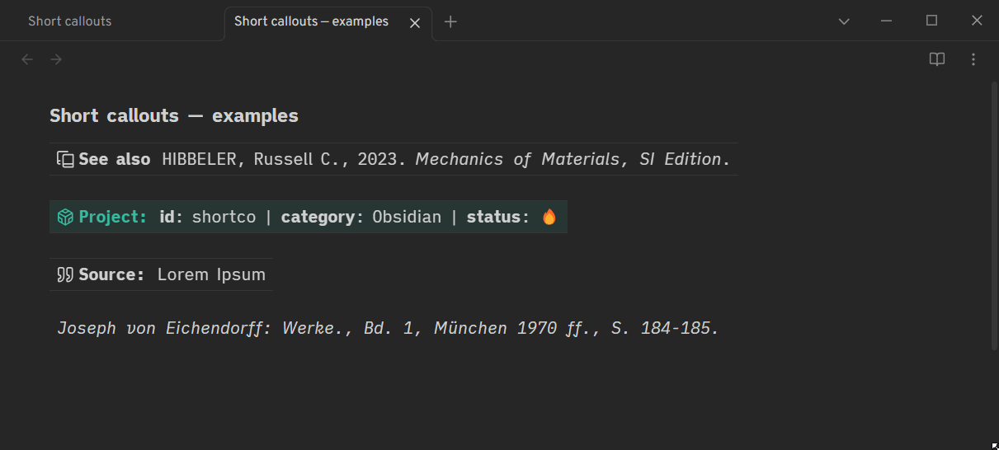
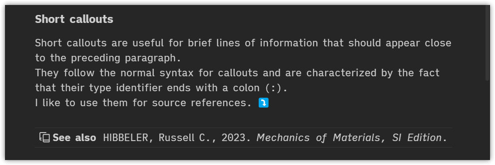
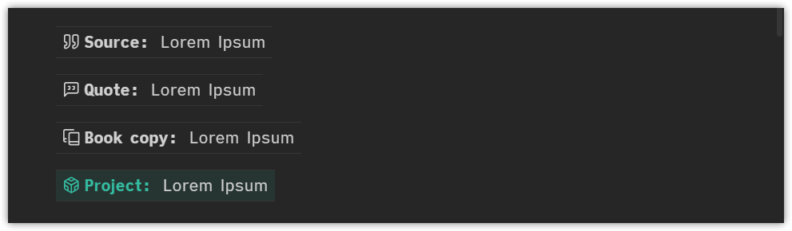
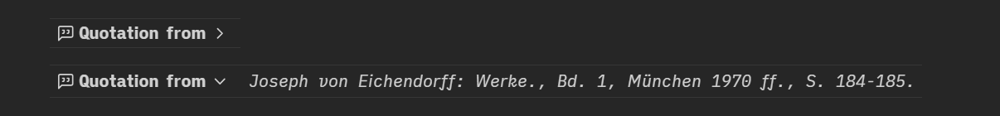

# 📣 Short callout CSS snippet for Obsidian

Short callouts are useful for brief lines of information that should appear close to the preceding paragraph.



## Usage

Download the [short-callout.css](https://github.com/ltroj/obsidian-short-callout/blob/main/short-callout.css "short-callout.css") snippet and save it to `.obsidian/snippets/` in your vault. Activate the snippet under `Settings > Appearance > CSS Snippets`.

## Examples

Short callouts follow the normal syntax for callouts and are characterized by the fact that their type identifier ends with a colon (:).
I like to use them for source references. ⤵️



```
> [!book-copy:] See also
> HIBBELER, Russell C., 2023. _Mechanics of Materials, SI Edition_.
```

Also useful as simple headers for project notes.


```
> [!project:]
>  **id**: shortco | **category**: Obsidian | **status**: 🔥
```

Some useful default types are already predefined:



```
> [!source:] 
> Lorem Ipsum

> [!quote:]
> Lorem Ipsum

> [!book-copy:]
> Lorem Ipsum

> [!project:]
> Lorem Ipsum
```

In order to customize icons, colors and type identifiers just edit the snippet or - even simpler - use the awesome [Callout Manager plugin](https://github.com/eth-p/obsidian-callout-manager).

As they are normal callouts, they can also be folded using the `+ -`  syntax. 



```
> [!quote:]- Quotation from
> *Joseph von Eichendorff: Werke., Bd. 1, München 1970 ff., S. 184-185.*

> [!quote:]+ Quotation from
> *Joseph von Eichendorff: Werke., Bd. 1, München 1970 ff., S. 184-185.*
```
